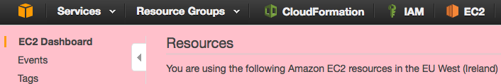
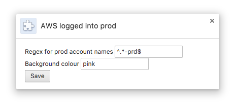

# Logged into prod

A Chrome extension that turns your entire AWS console pink (or whatever colour you like) when you are logged into the console of a production account.

[Install it here](https://chrome.google.com/webstore/detail/igiemippbohdpikalbgaimodceogkiec)

The regex for deciding what is a production account and the background colour to use are configurable:

## Future work

Could probably do the same thing quite easily for GCP projects
